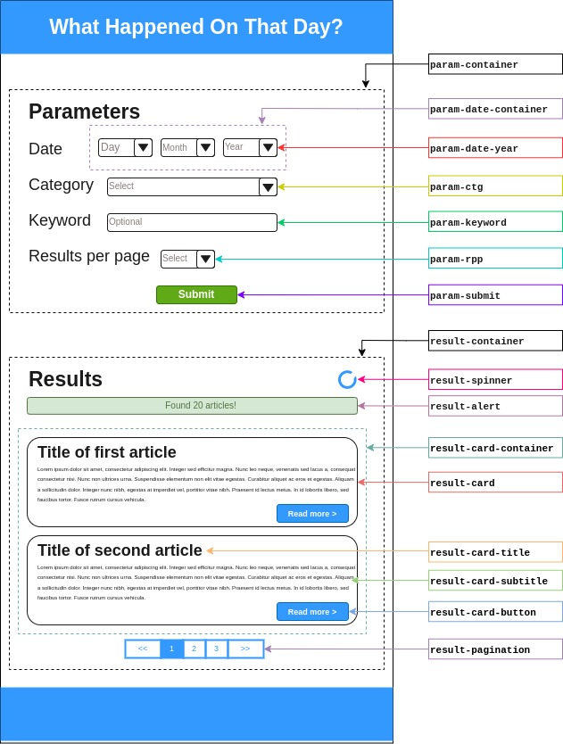

# WhatHappenedOnThatDay

A website that fetches a list of news based on **date, category and keywords** provided by user, which they can then click to read the full article.

## Table of Contents

- [:information\_source: Overview](#information_source-overview)
- [:technologist: Development](#technologist-development)
	- [:card\_index\_dividers: Folder Structure](#card_index_dividers-folder-structure)
	- [:handshake: Contribute](#handshake-contribute)
	- [:triangular\_ruler: Naming convention](#triangular_ruler-naming-convention)
		- [HTML](#html)
			- [Home Page](#home-page)
			- [Article Page](#article-page)
		- [JavaScript](#javascript)

## :information_source: Overview

- The website consists of 2 pages:
  - [**Home page**](homepage.html), which contains a form to select the parameters to filter the news and the list of matching news headlines.
  - [**Article page**](pages/article.html), which displays the full article of the selected news headline.
- The content of the website will be generated dynamically using **JavaScript**.
- News are fetched using [Reuters Business and Financial News API](https://rapidapi.com/makingdatameaningful/api/reuters-business-and-financial-news).
- Website's UI is built with [Bootstrap](https://getbootstrap.com/), a CSS framework that provides a responsive grid system and pre-built components.

## :technologist: Development

### :card_index_dividers: Folder Structure

- `assets/`: contains all the stylesheets and scripts.
- `docs/`: contains the assets for documentation.
- `pages/`: contains all the HTML pages (except the home page).

### :handshake: Contribute

1. :mag_right: **Check the [issues]()** to see if there is any that you would like to work on and assign yourself to it.
2. :herb: **Create a new branch** with the issue's number as the name.
	- _Example:_ 
		- If you want to work on issue #5, create a new branch named `5`.
		- If issue #5 have multiple sub-issues and you want to only work on one of them, create a new branch named `5-1`, `5-2`, etc.
3. :memo: **Make your changes, commit and push** them to the newly created branch.
	- :one: Each commit should focus on solving **one problem at a time**.
		- A few hundreds of commits won't hurt, so don't be afraid to commit often.
	- :warning: **Don't use GitHub's suggested commit message!** Instead, write the CM in the following format: `#<issue number>: <what have been fixed>`
		- Use lowercase.
		- Be as concise as possible with the CM. If you need to explain more, use the CM body.
		- _Example:_ `#5: add subtitle for query results`
4. :postbox: After you are done, **create a pull request** (PR) to the `main` branch.
	- If the issue wasn't solved completely, additional notes should be provided in the PR's description.

### :triangular_ruler: Naming convention

#### HTML

##### Home Page

.

##### Article Page

- :hourglass: WIP

#### JavaScript

- :hourglass: WIP
