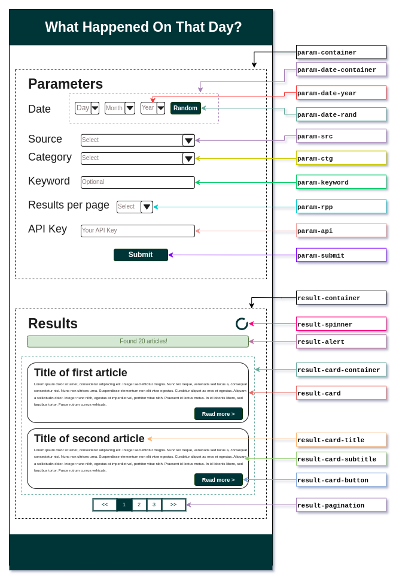

# WhatHappenedOnThatDay

A website that fetches a list of news and events based on **date, category and keywords** provided by user, which they can then click to read about the subject in greater detail.

## Table of Contents

- [:information\_source: Overview](#information_source-overview)
- [:technologist: Development](#technologist-development)
	- [:card\_index\_dividers: Folder Structure](#card_index_dividers-folder-structure)
	- [:handshake: Contribute](#handshake-contribute)
	- [:scroll: Convention](#scroll-convention)
		- [HTML](#html)
			- [Homepage](#homepage)
			- [Article](#article)
				- [News article](#news-article)
				- [Historical event](#historical-event)
		- [Source code](#source-code)
			- [Variable](#variable)
			- [Function](#function)
			- [Formatting](#formatting)

## :information_source: Overview

- The content of the website will be generated dynamically using **JavaScript**.
- News are fetched using [Reuters Business and Financial News API](https://rapidapi.com/makingdatameaningful/api/reuters-business-and-financial-news).
- Historical events are fetched using Wikimedia's [On this day API](https://api.wikimedia.org/wiki/API_reference/Feed/On_this_day).
- Website's UI is built with [Bootstrap](https://getbootstrap.com/), a CSS framework that provides a responsive grid system and pre-built components.

## :technologist: Development

### :card_index_dividers: Folder Structure

- `assets/`: contains components for building/styling the website.
	- `css/`
	- `img/`
	- `js/`
		- `data/`: pre-defined dataset for JS files.
- `docs/`: contains the assets for documentation.
	- `drawio/`: contains the source files for the diagrams.
	- `img/`: contains the images used in the documentation.
	- `json/`: example responses from the APIs.
- `pages/`: contains all the HTML pages (except the homepage).

### :handshake: Contribute

1. :mag_right: **Check the [issues](https://github.com/itsdmd/CS201-Final/issues)** to see if there is any that you would like to work on and assign yourself to it.
2. :herb: **Create a new branch** from the _Development_ section of issue's sidebar, with the issue's number as the name and select "Open branch with GitHub Desktop".
	- _Example:_
		- If you want to work on issue #5, go to the _Development_ section of issue 5 and create a new branch named `5`.
		- If issue #5 have multiple sub-issues and you want to only work on one of them, create a new branch named `5-1`, `5-2`, etc.
3. :memo: **Make your changes, commit and push** them to the newly created branch.
	- :one: Each commit should focus on solving **one problem at a time**.
		- A few hundreds of commits won't hurt, so don't be afraid to commit often.
	- :warning: **Don't use GitHub's suggested commit message!** Instead, write the CM in the following format: `#<(sub-)issue number>: <what have been fixed>`
		- Use lowercase.
		- Be as concise as possible with the CM. If you need to explain more, use the CM body.
		- _Example:_
			- `#5: add subtitle for query results`
			- `#10-2: adjust article's title's width`
4. :postbox: After you are done, **create a pull request** (PR) to the `main` branch.
	- If the issue wasn't solved completely, additional notes should be provided in the PR's description.

### :scroll: Convention

#### HTML

##### Homepage

.

##### Article

###### News article

.

###### Historical event

.

#### Source code

##### Variable

- Constant: `UPPER_SNAKE_CASE`
- Global: `g_camelCase`
- Assigned with HTML element: `e_camelCase`
- Local: `camelCase`

##### Function

- All functions should be named using `camelCase`.
- Functions that generate **HTML element**(s) should use **`generate`** prefix.
	- _Example:_ `generateResultCard()` will generate a `div` element with the class `result-card`.
- Functions that generate HTML elements' **content** should use **`populate`** prefix.
	- _Example:_ `populateResultCard()` will generate the content of a `div.result-card`, which can be its title and subtitle.
- Functions that return a value by combining multiple values/arguments should use **`construct`** prefix.

##### Formatting

- Use explicit comparison (`===` and `!==`). If value need to be converted, use `parseInt()` or `toString()`.
- Put a space after
	- `if`, `for`, `while`, etc.
	- Comment symbol (`//`)
	- Commas (`,`)
- Put spaces around operators (`=`, `+`, `&&`, etc.)
- Sort CSS elements' attributes alphabetically (use `Tyriar.sort-lines` VS Code extensions).
